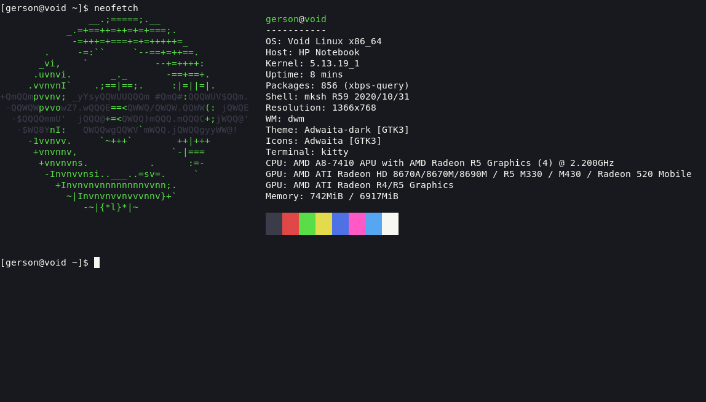

# Vampyric [kitty](https://https://sw.kovidgoyal.net/kitty/)
> A theme for kitty terminal 



## Installation
```
wget "https://raw.githubusercontent.com/VampyricDark/kitty/main/VampyricDark.conf" -P ~/.config/kitty/
cd ~/.config/kitty
ln -s ./VampyricDark.conf ~/.config/kitty/theme.conf
```

Add this line to your ``kitty.conf`` configuration file:

``include ./theme.conf``

## Team

Theme maintained by:
[gersonwahyudi](https://github.com/gersonwahyudi)
[RaphGL](https://github.com/RaphGL)
